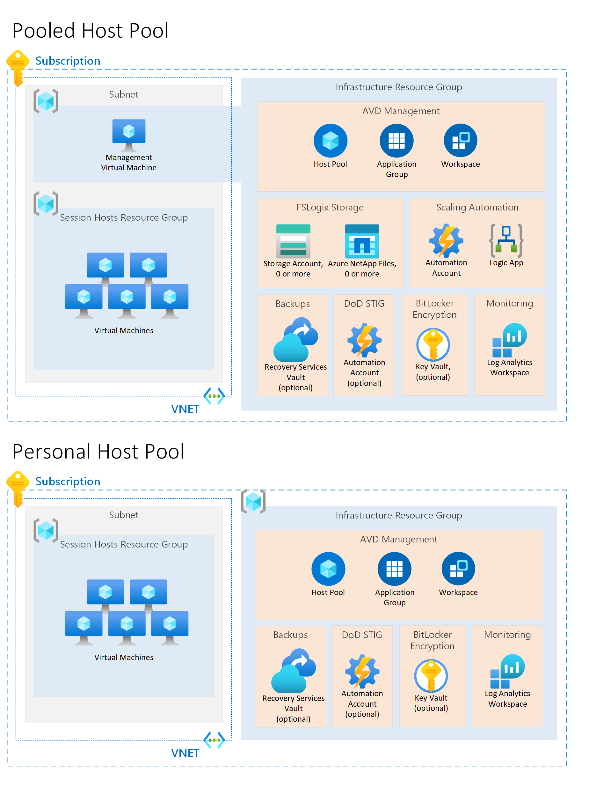

# Azure Virtual Desktop solution

## Deployment Options

### Azure Portal

[](https://portal.azure.com/#create/Microsoft.Template/uri/https%3A%2F%2Fraw.githubusercontent.com%2Fjamasten%2FAzure%2Fmaster%2Fsolutions%2Favd%2Fsolution.json)
[](https://portal.azure.us/#create/Microsoft.Template/uri/https%3A%2F%2Fraw.githubusercontent.com%2Fjamasten%2FAzure%2Fmaster%2Fsolutions%2Favd%2Fsolution.json)

### PowerShell

````powershell
New-AzDeployment `
    -Location '<Azure location>' `
    -TemplateFile 'https://raw.githubusercontent.com/jamasten/Azure/master/solutions/avd/solution.json' `
    -Verbose
````

### Azure CLI

````cli
az deployment sub create \
    --location '<Azure location>' \
    --template-uri 'https://raw.githubusercontent.com/jamasten/Azure/master/solutions/avd/solution.json'
````

## Description

This Azure Virtual Desktop (AVD) solution will deploy a fully operational [stamp](https://docs.microsoft.com/en-us/azure/architecture/patterns/deployment-stamp) in an Azure subscription.  Due to Azure deployment limitations, this solution will allow you to deploy shards to increase capacity while using the same AVD host pool, app group, log analytics workspace, etc. for the whole solution.  See the diagram below for more details:



Both a personal or pooled host pool can be deployed with this solution.  Either option will deploy a desktop application group with a role assignment. Selecting a pooled host pool will deploy the required resources and configurations to fully enable FSLogix.  This solution also automates many of the features that are usually enabled manually after deploying an AVD host pool.  Those features are:

- **FSLogix** - deploys the required resources to enable the feature when using Azure AD DS or AD DS:
  - Azure Storage Account or Azure NetApp Files with a fully configured file share
  - Management Virtual Machine with Custom Script Extension to:
    - Domain joins the Storage Account or creates the AD connection on the Azure NetApp Account
    - Sets the required permissions for access to the file share
  - Custom Script Extension on Session Hosts to enable FSLogix using registry settings
- **Scaling Automation** (pooled host pools only) - deploys the required resources to enable the tool:
  - Automation Account with a Managed Identity
    - Runbook
    - Variable
    - PowerShell Modules
  - Logic App
  - Contributor role assignment on the AVD resource groups, limiting the privileges the Automation Account has in your subscription
- **Start VM On Connect** (Optional) - deploys the required resources to enable the feature:
  - Role with appropriate permissions
  - Role assignment
  - Enables the feature on the AVD host pool
- **[Virtual Desktop Optimization Tool](https://github.com/The-Virtual-Desktop-Team/Virtual-Desktop-Optimization-Tool)** - removes unnecessary apps, services, and processes from Windows 10 or 11, improving performance and resource utilization.
- **Monitoring** - deploys the required resources to enable the Insights workbook:
  - Log Analytics Workspace with the required Windows Events and Performance Counters.
  - Microsoft Monitoring Agent on the session hosts.
  - Diagnostic settings on the AVD host pool and workspace.
- **GPU Drivers & Settings** - deploys the extension to install the graphics driver and creates the recommended registry settings when an appropriate VM size (Nv, Nvv3, Nvv4, or NCasT4_v3 series) is selected.
- **BitLocker Encryption** (Optional) - deploys the required resources & configuration to enable BitLocker encryption on the session hosts:
  - Key Vault with a Key Encryption Key
  - Azure Disk Encryption extension on the virtual machines
- **Backups** (Optional) - deploys the required resources to enable backups:
  - Recovery Services Vault
  - Backup Policy
  - Protection Container (File Share Only)
  - Protected Item
- **Screen Capture Protection** (Optional) - deploys the required registry setting on the AVD session hosts to enable the feature.
- **Drain Mode** (Optional) - when enabled, the sessions hosts will be deployed in drain mode to ensure end users cannot access the host pool until operations is ready to allow connections.
- **RDP ShortPath** (Optional) - deploys the requirements to enable RDP ShortPath for AVD.
- **SMB Multichannel** - Enables multiple connections to an SMB share.  This feature is only supported with a premium Azure Storage Account.
- **High Availability** (Optional) - allows the virtual machines to be deployed in either Availability Zones or Availability Sets, to provide a higher SLA for your solution.  This is only applicable to pooled host pools.  SLA: 99.99% for Availability Zones, 99.95% for Availability Sets.

## Assumptions

To successfully deploy this solution, you will need to ensure your scenario matches the assumptions below:

- [Supported operating system and licensing](https://docs.microsoft.com/en-us/azure/virtual-desktop/overview#requirements)
- Landing zone deployed in Azure:
  - Virtual network and subnet(s)
  - Deployed and configured domain services if domain or hybrid joining the session hosts
- Azure Subscription Owner: this solution contains many role assignments so the principal deploying this solution will need to be a Subscription Owner for a successful deployment.

## Prerequisites

To successfully deploy this solution, you will need to first ensure the following prerequisites have been completed:

- Create a service principal or user account to domain join the session hosts if applicable.  Azure AD joined session hosts do not apply.
- Create a security group for your AVD users and if applicable, ensure the principal has synchronized with your domain services (Azure AD DS) or directory (AD DS).
- If you plan to use Azure NetApp Files with FSLogix, complete the following:
  - [Register the resource provider](https://docs.microsoft.com/en-us/azure/azure-netapp-files/azure-netapp-files-register)
  - [Delegate a subnet to Azure NetApp Files](https://docs.microsoft.com/en-us/azure/azure-netapp-files/azure-netapp-files-delegate-subnet)
  - [Enable the shared AD feature](https://docs.microsoft.com/en-us/azure/azure-netapp-files/create-active-directory-connections#shared_ad): this feature is required if you plan to deploy more than one domain joined NetApp account in the same Azure subscription and region.  As of 1/31/2022, this feature is in "public preview" in Azure Cloud and not available in Azure US Government.

## Considerations

If you need to redeploy this solution b/c of an error or other reason, be sure the virtual machines are turned on.  If your host pool is "pooled", I would recommended disabling your logic app to ensure the scaling solution doesn't turn off any of your VM's during the deployment.  If the VM's are off, the deployment will fail since the extensions cannot be validated / updated.

## Post Deployment Suggestion

When deploying FSLogix, a management VM is deployed to facilitate the domain join of the Azure Storage Account, if applicable, and sets the NTFS permissions on the chosen storage solution.  After the deployment succeeds, this VM and its associated resources may be removed.

## Sharding to Increase Capacity

This solution has been updated to allow sharding.  A shard provides additional capacity to an AVD stamp.  See the options below for increasing network or storage capacity.  

### Network Shard

To add networking capacity to an AVD stamp, a new virtual network should be staged prior to deploying this code.  When running a new deployment specify the new values for the "VirtualNetwork", "VirtualNetworkResourceGroup", and "Subnet" parameters.  The sessions hosts will be deployed to the new virtual network.  The "SessionHostIndex" and "SessionHostCount" parameters will also play into the network shards.  For example:

| Shard | VNET           | Subnet  | Session Host Index | Session Host Count |
|-------|----------------|---------|--------------------|--------------------|
| 0     | vnet-p-eus-000 | Clients | 0                  | 250                |
| 1     | vnet-p-eus-001 | Clients | 250                | 250                |
| 2     | vnet-p-eus-002 | Clients | 500                | 250                |

In this example, each shard will contain 250 session hosts and each set of sessions hosts will be in different VNET.

### Storage Shard

To add storage capacity to an AVD stamp, the "StorageShardIndex" parameter should be incremented by 1 for every deployment.  The last two digits in the name for the chosen storage solution will be incremented between each deployment.  The "VHDLocations" setting will include all the file shares.  The "SecurityPrincipalId" and "SecurityPrincipalName" should differ between each deployment for the RBAC assignment and NTFS permissions on the storage solution.  Each user in the stamp should only have access to one file share. When the user accesses a session host, their profile will load from the one file share.  
